# 设计模式

* [设计模式概述](#设计模式概述)
* [单一职责原则](#单一职责原则)
* [接口隔离原则(Interface Segregation Principle)](#接口隔离原则interface-segregation-principle)
* [依赖倒转原则(Dependence Inversion Principle)](#依赖倒转原则dependence-inversion-principle)
    * [依赖关系传递的三种方式](#依赖关系传递的三种方式)
    * [依赖倒转原则的注意事项和细节](#依赖倒转原则的注意事项和细节)
* [里氏替换原则(Liskov Substitution Principle)](#里氏替换原则liskov-substitution-principle)
* [开闭原则（Open Closed Principle）](#开闭原则（open-closed-principle）)
* [迪米特法则(Demeter Principle)](#迪米特法则demeter-principle)
* [合成复用原则(Composite Reuse Principle）](#合成复用原则composite-reuse-principle）)
* [设计原则核心思想](#设计原则核心思想)
* [UML图介绍](#uml图介绍)
  * [UML类图](#uml类图)
  * [IDEA插件 PlantUML使用介绍](#idea插件-plantuml使用介绍)


[toc]

# 设计模式概述

**<font color='green'>设计模式的目的：</font>**

- 编写软件过程中，程序员面临着来自 耦合性，内聚性以及可维护性，可扩展性，重用性，灵活性 等多方面的挑战，设计模式是为了让程序(软件)，具有更好的：
    1. 代码重用性 (即：相同功能的代码，不用多次编写)
    2. 可读性 (即：编程规范性, 便于其他程序员的阅读和理解)
    3. 可扩展性 (即：当需要增加新的功能时，非常的方便，称为可维护)
    4. 可靠性 (即：当我们增加新的功能后，对原来的功能没有影响)
    5. 使程序呈现高内聚，低耦合的特性


**<font color='green'>设计模式七大原则：</font>**

- **设计模式原则，其实就是程序员在编程时，应当遵守的原则，也是各种设计模 式的基础**  即：设计模式为什么这样设计的依据

- 设计模式常用的七大原则有:

    1. <font color='red'>单一职责原则</font>
    2. <font color='red'> 接口隔离原则 </font>
    3. <font color='red'>依赖倒转(倒置)</font>
    4. <font color='red'>里氏替换原则 </font>
    5. <font color='red'>开闭原则 </font>
    6. <font color='red'> 迪米特法则 </font>
    7. <font color='red'>合成复用原则</font>

---


# 单一职责原则

**<font color='green'>基本介绍:</font>**

- 对类来说的，<font color='red'>即一个类应该只负责一项职责</font>。

-  例如：JDBC中的DAO类。  一个UserDAO只对应数据库中User这个表。 **如果让这个UserDAO即可以对User表进行操作，还可以对其他表进行操作，那么他就违反了单一职责原则。 当我们去修改对User表的相关操作时，可能会影响到对其他表的操作**。

   这个时候我们就需要对这个类进行分解。 使它满足单一职责原则。

   


**举例：**

```java
public class Vehicle {
    public void run(String vehicle){
        System.out.println(vehicle+"在公路上跑");
    }
}

class VehicleTest{
    @Test
    public  void testVehicle(){
        Vehicle vehicle = new Vehicle();
        vehicle.run("汽车");
        vehicle.run("飞机");
        vehicle.run("轮船");
    }
}

```


**运行结果：**


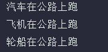

很显然，这个Vehicle类违反了单一职责原则。 因为不管是汽车，飞机，轮船都可以在公路上跑是不对的。不同的交通工具应该有不同的运行方式。

**改进1：**

```java
public class Vehicle2Test {
    @Test
    public void testVehicle() {
        RoadVehicle roadVehicle = new RoadVehicle();
        AirVehicle airVehicle = new AirVehicle();
        WaterVehicle waterVehicle = new WaterVehicle();
        roadVehicle.runRoad("汽车");
        airVehicle.runAir("飞机");
        waterVehicle.runWater("轮船");
    }
}


class RoadVehicle {
    public void runRoad(String vehicle) {
        System.out.println(vehicle + "在公路上跑");
        
    }
}

class AirVehicle {
    public void runAir(String vehicle) {
        System.out.println(vehicle + "在天上上飞");
        
    }
}

class WaterVehicle {
    public void runWater(String vehicle) {
        System.out.println(vehicle + "在水上跑");
        
    }
}

```


**运行结果：**

- 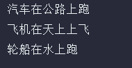


这种改进方法就完全遵守了单一职责原则，每个类都只负责一件事。 但是他也有弊端。

1.  我们本来的类只有一个方法，但是经过分解，现在变成了3个类3个方法。 代码量显著增加。
2. 这种分解造成了代码的臃肿。


**改进2：**

```java
public class Vehicle3Test {
    @Test
    public  void testVehicle(){
        Vehicle2 vehicle2 = new Vehicle2();
        vehicle2.runRoad("汽车");
        vehicle2.runAir("飞机");
        vehicle2.runWater("轮船");
    }
    
}

class Vehicle2{
    public void runRoad(String vehicle) {
        System.out.println(vehicle + "在公路上跑");
    }
    
    public void runAir(String vehicle) {
        System.out.println(vehicle + "在天上上飞");
    }
    
    public void runWater(String vehicle) {
        System.out.println(vehicle + "在水上跑");
    }
}
```


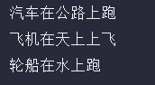


这种改进方法并没有在类的基础上遵守单一职责原则， 但是在方法的层面上，仍然遵守。

一个方法对应一种交通工具。 这样做的好处就是我们不用区建那么多的类。 只需要把当前类中的方法给分解成几个方法即可。

但是需要注意的是，只有逻辑足够简单，才可以在代码级别违反单一职责原则；只有类中方法数量足够少，可以在方法级别保持单一职责原则。


**总结：**

- 降低类的复杂度，一个类只负责一项职责。 
-  提高类的可读性，可维护性 
- 降低变更引起的风险 
- 通常情况下，我们应当遵守单一职责原则，<font color='red'>只有逻辑足够简单，才可以在代码级别违反单一职责原则</font>；<font color='red'>只有类中方法数量足够少，可以在方法级别保持单一职责原则</font>

---


# 接口隔离原则(Interface Segregation Principle)


**基本介绍：**

- <font color='red'>客户端不应该依赖它不需要的接口，即一个类对另一个类的依赖 应该建立在最小的接口上</font>

**举例说明：**

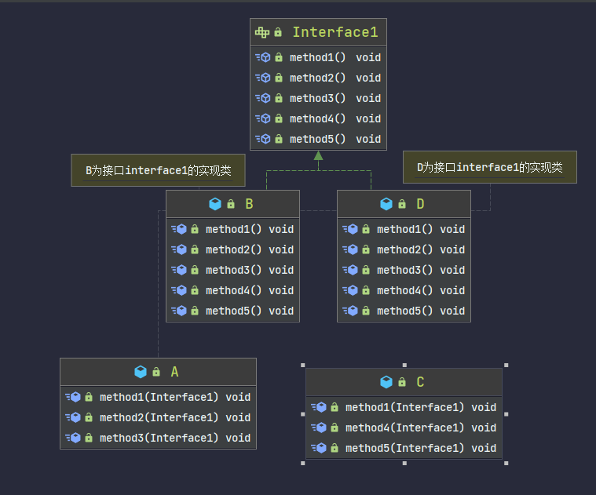


```java

public class B implements Interface1{
    
    @Override
    public void method1() {
    
    }
    
    @Override
    public void method2() {
    
    }
    
    @Override
    public void method3() {
    
    }
    
    @Override
    public void method4() {
    
    }
    
    @Override
    public void method5() {
    
    }
}

public class D  implements Interface1{
    @Override
    public void method1() {
    
    }
    
    @Override
    public void method2() {
    
    }
    
    @Override
    public void method3() {
    
    }
    
    @Override
    public void method4() {
    
    }
    
    @Override
    public void method5() {
    
    }
}


public class A {
    public void method1(Interface1 interface1){
    
    }
    public void method2(Interface1 interface1){
    
    }
    public void method3(Interface1 interface1){
    
    }
}

public class C {
    public void method1(Interface1 interface1){
    
    }
    public void method4(Interface1 interface1){
    
    }
    public void method5(Interface1 interface1){
    
    }
}
public class InterfaceTest {
    public static void main(String[] args) {
    
        A a = new A();
        a.method1(new B());
        a.method2(new B());
        a.method3(new B());
    
        C c = new C();
        c.method1(new D());
        c.method4(new D());
        c.method5(new D());
    }
}

```


A类所依赖的B这个类，他是接口interface1的实现类，实现了interface1的全部方法。 但是A这个类，只用到了interface1中的1，2，3这三个方法。

C这个类也相同。C类所依赖的D这个类，他也是接口interface1的实现类，实现了interface1的全部方法。 但是C这个类，只用到了interface1中的1，4，5这三个方法。

很显然，A和C这两个类并没有用到接口中的所有方法。但是因为接口中有这5个方法，所以B和D实现类就必须实现所有方法。

接口 Interface1对于类A和类C来说都不是最小接口，这样就违背了接口隔离原则，B和D被迫实现了根本没有必要实现得方法。


**解决方案：**

- 对当前接口interface1进行分解。

  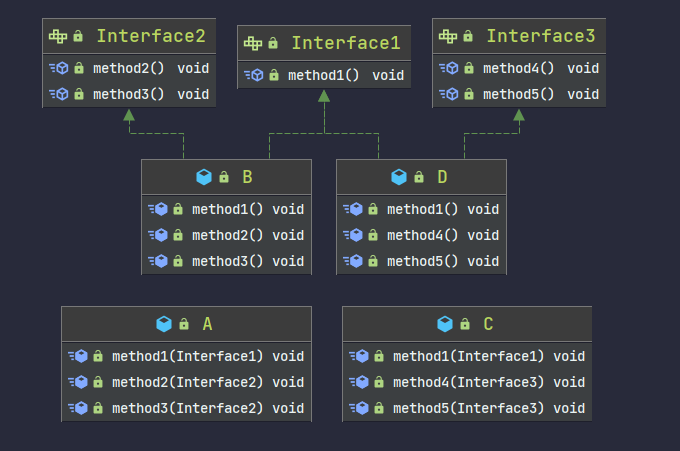

将interface1，拆分成3个接口。 这样一来，B这个实现类只需要实现interface1和2即可满足所有要求。 D只需要实现interface1和3即可满足所有要求。

B和D都不需要去实现多余的方法。 这样一来就满足了接口隔离原则。

即： A对于B的依赖建立在最小的接口上。 C与D同理。


```java
public class B  implements Interface1,Interface2{
    @Override
    public void method1() {
    
    }
    
    @Override
    public void method2() {
    
    }
    
    @Override
    public void method3() {
    
    }
}


public class D implements Interface1,Interface3{
    @Override
    public void method1() {
    
    }
    
    @Override
    public void method4() {
    
    }
    
    @Override
    public void method5() {
    
    }
}

public class A {
    public void method1(Interface1 interface1){
    
    }
    public void method2(Interface2 interface1){
    
    }
    public void method3(Interface2 interface1){
    
    }
}

public class C {
    public void method1(Interface1 interface1){
    
    }
    public void method4(Interface3 interface2){
    
    }
    public void method5(Interface3 interface2){
    
    }
}

public class InterfaceTest {
    public static void main(String[] args) {
        
        A a = new A();
        a.method1(new B());
        a.method2(new B());
        a.method3(new B());
        
       C c = new C();
        c.method1(new D());
        c.method4(new D());
        c.method5(new D());
    }
}

```


---


# 依赖倒转原则(Dependence Inversion Principle)

**基本介绍：**

- 高层模块不应该依赖低层模块，二者都应该依赖其抽象。
- 抽象不应该依赖细节，细节应该依赖抽象
  - <font color='red'>接口(抽象类)不应该依赖它的实现类，它的实现类应该依赖接口(抽象类)</font>
- 依赖倒转(倒置)的中心思想是面向接口编

**在java中，<font color='red'>抽象 指的是接口或抽象类</font>，<font color='red'>细节就是具体的实现类</font>**

​	

**举例说明：**

- 假如有一个Person类，他有接收消息的功能。

  <font color='green'>方式1：</font>

  ```java
  
  class Email {
      public String getMessage(){
          return "这是一条邮件消息";
      };
  }
  
  public class Person1 {   
      public void receiver(Email email){
          System.out.println(email.getMessage());
      }
      
  }
  
  class Person1Test{
      @Test
      public void test1(){
          Person1 person1 = new Person1();
          person1.receiver(new Email());
      }
  }
  ```

  这种方法比较简单，能够最先想到。  但是他有一些缺点。  如果我们获取的对象是 微信，短信等等，则需要新增类，同时Person1也要增加相应的接收方法


​	<font color='green'>方法2：</font>

解决思路：引入一个抽象的接口IReceiver, 表示接收者, 让Person类与接口IReceiver发生依赖

因为Email, WeiXin 等等属于接收的范围，他们各自实现IReceiver 接口就ok, 这样我们就符合依赖倒转原则

```java
interface IReceiver{
    String getMessage();
}

class Email1 implements IReceiver{   
    @Override
    public String getMessage() {
        return "这是一条邮件信息";
    }
}

class WeiChat implements IReceiver{
    @Override
    public String getMessage() {
        return "这是一条微信信息";
    }
}


public class Person2 {   
    //这里我们是对接口的依赖
    public void getMessage(IReceiver iReceiver){
        System.out.println(iReceiver.getMessage());
    }    
}

class Person2Test{
    @Test
    public void test(){
        Person2 person2 = new Person2();
        person2.getMessage(new Email1());
        person2.getMessage(new WeiChat());
    }
}
```

此方法，当我们想要添加新的发送消息工具时，根本不需要修改Person类。 只需要添加IReceiver接口的实现类即可。 

然后将实现类的对象作为参数传递给Person类`getMessage()`方法即可。 


### 依赖关系传递的三种方式

1. **接口传递** 

2. **构造方法传递** 

3. **setter方式传递**

   

**接口传递：**

```java
//方式1： 接口传递
interface TV{
    void play();
}

interface OpenAndClose{
    void opened(TV tv);
}

class Open implements OpenAndClose{
    //通过在接口中给我传入一个接口，来实现对接口的依赖。 
    @Override
    public void opened(TV tv) {
       tv.play();
    }
}


class Haier implements TV{
    //海尔电视实现了TV接口。 所以它有打开方法
    @Override
    public void play() {
        System.out.println("海尔电视打开");
    }
}

public class DependencyPass {
    @Test
    public void testDependency(){
        Haier haier = new Haier();
        Open open = new Open();
        open.opened(haier);
    }

}
```


**构造方法传递：**

```java
interface TV2{
    void play();
}

interface OpenAndClose2{
    void open();
}

class Open2 implements OpenAndClose2{
    TV2 tv;
    //通过构造方法来传入一个接口，实现对接口的依赖
    public Open2(TV2 tv2){
        this.tv = tv2;
    }
    
    @Override
    public void open() {
        this.tv.play();
    }
    
}

class SkyWorth implements TV2{
    @Override
    public void play() {
        System.out.println("创维电视打开");
    }
}

public class DependencyPass2 {
    @Test
    public void test(){
        SkyWorth skyWorth = new SkyWorth();
        Open2 open2 = new Open2(skyWorth);
        open2.open();
    }
}

```

 

**setter方式传递：**

 与构造器传递方式类似，通过setter方法。

```java 
interface TV3{
    void play();
}

interface OpenAndClose3{
    void open();
}

class Open3 implements OpenAndClose3{
    TV3 tv;
    
    //与第二种方式相比，把构造器换成了setter方法。 
    public void setTv(TV3  tv3){
        this.tv = tv3;
    }
    
    @Override
    public void open() {
        this.tv.play();
    }
    
}

class XiaoMI implements TV3{
    @Override
    public void play() {
        System.out.println("小米电视打开");
    }
}

public class DependencyPass3 {
    @Test
    public  void  testing(){
        XiaoMI xiaoMI = new XiaoMI();
        Open3 open3 = new Open3();
        open3.setTv(xiaoMI);
        open3.open();
    }
}
```


### 依赖倒转原则的注意事项和细节

- 低层模块尽量都要有抽象类或接口，或者两者都有，程序稳定性更好. 
  - 如果A类是一个子类，它的上一级最好有接口或者抽象类。 不要孤零零的放置一个类。 
- 变量的声明类型尽量是抽象类或接口, 这样我们的变量引用和实际对象间，就存在 一个缓冲层，利于程序扩展和优化 
  - 当我们想要添加新的功能时，不需要直接去修改对应的类，只需要提供新的接口(抽象类)得实现类作为参数传递给他即可。
- 继承时遵循里氏替换原则


---


# 里氏替换原则(Liskov Substitution Principle)

**OO中的继承性的思考和说明：**

-  继承包含这样一层含义：父类中凡是已经实现好的方法，实际上是在设定规范和契
  约，虽然它不强制要求所有的子类必须遵循这些契约，但是如果子类对这些已经实
  现的方法任意修改，就会对整个继承体系造成破坏。
- 继承在给程序设计带来便利的同时，也带来了弊端。如果一个类被其他的类所继承，
  则当这个类需要修改时，必须考虑到所有的子类，并且父类修改后，所有涉及到子
  类的功能都有可能产生故障

**基本介绍：**

- 里氏替换原则(Liskov Substitution Principle)在1988年，由麻省理工学院的以为姓里 的女士提出的。

- 该原则规定 在使用继承时，<font color='red'>在子类中可以扩展父类的功能，但是尽量不要重写父类的方法</font>。

- 如果有2个类 A和B， B类继承A类。 那么在所有用到A类对象的地方，都可以用B类对象来替换。 **这就是里氏替换原则的完美状态。**

  - 因为要求是在所有地方，所以如果想要达到此效果，B类就不能修改A类中的任何方法。

  例：

  ```java
  class A{
      public void sayHello(){
          System.out.println("hello");
      }
  }
  
  class B extends A{
  
  }
  
  public class Example {
      @Test
      public void test(){
          A a = new A();  
          a.sayHello();
          //如果使用B类对象来替换
          //A a = new B();
          // a.sayHello(); 所完成的效果是一样的。   
          //因为要求是在所有地方，所以如果想要达到此效果，B类就不能修改A类中的任何方法。
      }
  }
  
  
  ```

  

-  里氏替换原则告诉我们，继承实际上让两个类耦合性增强了，在适当的情况下，可以通过聚合，组合，依赖 来解决问题。

**举例说明：**

```java

class A{
    public void method(){
        System.out.println("A,B类共有的方法");
    }
    public void sayHello(){
        System.out.println("A say hello");
    }
}

//	B继承与A，并且重写了A类的sayHello( )方法。 由于没有重写method()方法， 所以B类和A类的method()是一样的
class B extends A{
    @Override
    public void sayHello(){
        System.out.println("B say hello");
    }
}
```


这样很现实并没有遵循里氏替换原则，所以我们要对其进行修改。

我们吧A和B中共有的单独抽出来放到一个新的基础类中，让A1,B1分别继承Base类。 这样A1和B1就不再是继承关系。 

```java
class Base{
    //把共有的方法单独抽出来
    public void method(){
        System.out.println("A,B共有的方法");
    }
}

class A1 extends Base{
    public void sayHello(){
        System.out.println("A1 say hello");
    }
}

class B1 extends Base{
    public void sayHello(){
        System.out.println("B1 say hello");
    }
}

```

经过这样的解耦，很显然A1和B1都遵循了里氏替换原则，因为他们都没有修改Base类中的方法。

UML图如下：

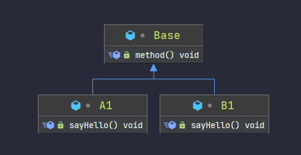


如果想要在B1中访问A1的方法， 就可以通过使用组合关系，来访问A1的方法。

例：

```java
class B1 extends Base{
    //在B1中创建一个A1类对象的成员变量
    private A1 a1 = new A1();
    public void sayHello(){
        System.out.println("B1 say hello");
    }
    
    
    public void sayHello1(){
        //通过该对象即可使用A1类中的方法
        a1.sayHello();
    }
}
```

对应的UML图如下：

​	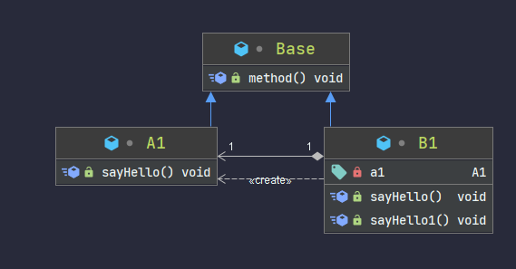


---


# 开闭原则（Open Closed Principle）


**基本介绍：**

- <font color='red'>是编程中最基础、最重要的设计原则</font>。

- 一个软件实体如**类**，**模块**和**函数**应该<font color='red'>对扩展开放(对提供方)</font>，对<font color='red'>修改关闭(对使用 方)</font>。用抽象构建框架，用实现扩展细节。

  - 也就是说，当我们去扩展一个新的功能时，应该只去修改提供方的代码，而使用方最好不要动。

- 当软件需要变化时，<font color='red'>尽量通过扩展软件实体的行为来实现变化，而不是通过修改已 有的代码来实现变化</font>。

  - 尽量不要通过修改原有的代码来实现新的功能，可以通过增加新的方法。 因为原有的代码可能被别的地方使用

    如果进行修改，有可能会出错。

-  **<font color='red'>编程中遵循其它原则，以及使用设计模式的目的就是遵循开闭原则</font>**。


**举例说明：**

```java

//这是一个用于绘图的类 [使用方]
class GraphicEditor {
    //接收Shape对象，然后根据type，来绘制不同的图形
    public void drawShape(Shape s) {
        if (s.m_type == 1)
            drawRectangle(s);
        else if (s.m_type == 2)
            drawCircle(s);
        //新增一个画三角形的方法，就要多一个判断条件
        else if (s.m_type == 3)
            drawTriangle(s);
    }
    
    //绘制矩形
    public void drawRectangle(Shape r) {
        System.out.println(" 绘制矩形 ");
    }
    
    //绘制圆形
    public void drawCircle(Shape r) {
        System.out.println(" 绘制圆形 ");
    }
    
    //新增绘制三角形的方法  
    public void drawTriangle(Shape r) {
        System.out.println(" 绘制三角形 ");
    }
}

//下面的图形类都是提供方

//Shape类，基类 
class Shape {
    int m_type;
}

class Rectangle extends Shape {
    Rectangle() {
        super.m_type = 1;
    }
}

class Circle extends Shape {
    Circle() {
        super.m_type = 2;
    }
}

//新增画三角形
class Triangle extends Shape {
    Triangle() {
        super.m_type = 3;
    }
}

```


- 当我们去新增一个画其他图形的功能时，不仅要新建一个图形的class，还要再使用方的代码中提供相应的判断，和绘制方法。

-  违反了设计模式的ocp原则，即对扩展开放(提供方)，对修改关闭(使用方)。 即当我们给类增加新功能的时候，尽量不修改代码，或者尽可能少修改代码.

**改进方案：**

- 我们可以抽象出来一个图形基类，该类为抽象类，有一个绘制图形的方法。 其他图形类只要继承他实现方法即可。

  ```java
  //抽象基类
  abstract class Graphic{
      abstract void draw();
  }
  
  
  class Circle1 extends Graphic{
      @Override
      void draw() {
          System.out.println(" 绘制圆形 ");
      }
  }
  
  class Triangle1 extends Graphic{
      @Override
      void draw() {
          System.out.println(" 绘制三角形 ");
      }
  }
  
  class Rectangle1 extends Graphic{
      @Override
      void draw() {
          System.out.println(" 绘制矩形 ");
      }
  }
  
  //图形绘制类，使用方 
  class GraphicEditor1{
      //通过调用不同实现类的draw()方法，来绘制不同的图形
      public void draw(Graphic graphic){
          graphic.draw();
      }
  }
  
  //测试
  public class Ocp {
      @Test
      public void test(){
          GraphicEditor1 graphicEditor1 = new GraphicEditor1();
          graphicEditor1.draw(new Circle1());
          graphicEditor1.draw(new Triangle1());
          graphicEditor1.draw(new Rectangle1());
      }     
  }
  
  ```

  - 很显然，当我们还想要增加绘制新的图形时，根本不需要去动使用方的代码。 只需要新增一个实现类即可。
  - 然后让此实现类作为参数传给draw()方法即可。
  - 使用方的代码就不需要修 -> 满足了开闭原则。

---


# 迪米特法则(Demeter Principle)

**基本介绍：**

- 一个对象应该对其他对象保持最少的了解。
- <font color='red'>迪米特法则(Demeter Principle)又叫最少知道原则</font>，即一个类对自己依赖的类知道的越少越好。也就是说，对于被依赖的类不管多么复杂，都尽量将逻辑封装在类的内部。对外除了提供的public 方法，不对外泄露任何信息。
-  迪米特法则还有个更简单的定义：只与直接的朋友通信

 **直接的朋友：**

- 每个对象都会与其他对象有耦合关系，**只要两个对象之间有耦合关系，我们就说这两个对象之间是朋友关系**。耦合的方式很多，依赖，关联，组合，聚合
  等。<font color='red'>其中，我们称出现成员变量，方法参数，方法返回值中的类为直接的朋友</font>，<font color='red'>而出现在局部变量中的类不是直接的朋友</font>。也就是说，陌生的类最好不要以局部变量的形式出现在类的内部。

**举例说明：**

```java
//学校总部员工类
class Employee {
	private String id;

	public void setId(String id) {
		this.id = id;
	}

	public String getId() {
		return id;
	}
}


//学院的员工类
class CollegeEmployee {
	private String id;

	public void setId(String id) {
		this.id = id;
	}

	public String getId() {
		return id;
	}
}


//管理学院员工的管理类
class CollegeManager {
	//返回学院的所有员工
	public List<CollegeEmployee> getAllEmployee() {
		List<CollegeEmployee> list = new ArrayList<CollegeEmployee>();
		for (int i = 0; i < 10; i++) { //这里我们增加了10个员工到 list
			CollegeEmployee emp = new CollegeEmployee();
			emp.setId("学院员工id= " + i);
			list.add(emp);
		}
		return list;
	}
}

//学校管理类

//分析 SchoolManager 类的直接朋友类有哪些 -》 Employee、CollegeManager
//CollegeEmployee 不是 直接朋友 而是一个陌生类，这样违背了 迪米特法则 
class SchoolManager {
	//返回学校总部的员工
	public List<Employee> getAllEmployee() {
		List<Employee> list = new ArrayList<Employee>();
		
		for (int i = 0; i < 5; i++) { //这里我们增加了5个员工到 list
			Employee emp = new Employee();
			emp.setId("学校总部员工id= " + i);
			list.add(emp);
		}
		return list;
	}

	//该方法完成输出学校总部和学院员工信息(id)
	void printAllEmployee(CollegeManager sub) {
        
		//获取到学院员工
		List<CollegeEmployee> list1 = sub.getAllEmployee();
		System.out.println("------------学院员工------------");
		for (CollegeEmployee e : list1) {
			System.out.println(e.getId());
		}
	
		//获取到学校总部员工
		List<Employee> list2 = this.getAllEmployee();
		System.out.println("------------学校总部员工------------");
		for (Employee e : list2) {
			System.out.println(e.getId());
		}
	}
}

```

​		很显然，前面设计的问题在于SchoolManager类中，CollegeEmployee类并不是 SchoolManager类的直接朋友。

​		按照迪米特法则，应该避免类中出现这样非直接朋友关系的耦合.

改进方案： 只对 CollegeManager 和 SchoolManager 修改，其他类不用动。 

```java
//管理学院员工的管理类
class CollegeManager {
	//返回学院的所有员工
	public List<CollegeEmployee> getAllEmployee() {
		List<CollegeEmployee> list = new ArrayList<CollegeEmployee>();
		for (int i = 0; i < 10; i++) { //这里我们增加了10个员工到 list
			CollegeEmployee emp = new CollegeEmployee();
			emp.setId("学院员工id= " + i);
			list.add(emp);
		}
		return list;
	}
   
    //把打印员工的具体实现方法，封装到CollegeManager类中。 不要对外暴露
    public void printAllEmployees(){
     	 //获取到学院员工
		List<CollegeEmployee> list1 = this.getAllEmployee();
		System.out.println("------------学院员工------------");
		for (CollegeEmployee e : list1) {
			System.out.println(e.getId());
		}
    }
}


class SchoolManager {
	//返回学校总部的员工
	public List<Employee> getAllEmployee() {
		List<Employee> list = new ArrayList<Employee>();
		
		for (int i = 0; i < 5; i++) { //这里我们增加了5个员工到 list
			Employee emp = new Employee();
			emp.setId("学校总部员工id= " + i);
			list.add(emp);
		}
		return list;
	}

	//该方法完成输出学校总部和学院员工信息(id)
	void printAllEmployee(CollegeManager sub) {
        
		//我们只需要在这里调用打印所有学院员工的方法即可。 把具体实现的方法封装到CollegeManager中
        sub.printAllEmployees();
        
		//获取到学校总部员工
		List<Employee> list2 = this.getAllEmployee();
		System.out.println("------------学校总部员工------------");
		for (Employee e : list2) {
			System.out.println(e.getId());
		}
	}
}


```

​			通过这样的改进，我们成功消除了陌生的朋友CollegeEmployee。 遵循了迪米特法则


**迪米特法则注意事项和细节：**

- 迪米特法则的核心是<font color='red'>降低类之间的耦合</font>
- 但是注意：由于每个类都减少了不必要的依赖，因此迪米特法则<font color='red'>只是要求降低 类间(对象间)耦合关系， 并不是要求完全没有依赖关系</font>


---


# 合成复用原则(Composite Reuse Principle）

**基本介绍：**

- 原则是<font color='red'>尽量使用合成/聚合的方式，而不是使用继承</font>
- 使用继承的话，会增加他们之间的耦合性，这样并不好。


**举例说明：**  假如A中有两个方法method1和method2.  B想用这两个方法。


- 解决方式1： 使用继承关系，让B继承A类，就可以用A类中两个方法。

  该方法会增加他们之间的耦合性，这样并不好。

  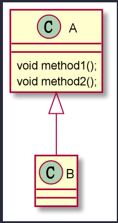	

- 解决方式2：  让B通过方法参数来调用A中的方法。 这样就降低了耦合度。 并且符合了迪米特法则。

  A是B的直接朋友。

  ​	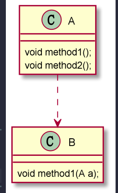

  

- 解决方式3： 让B中新建一个成员变量，该变量是A类型的。 通过set方法来给该变量赋值

  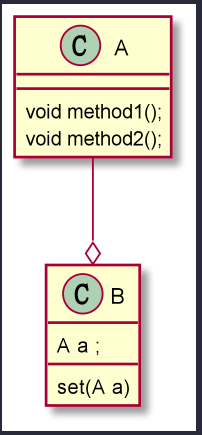	

- 解决方法4：  让B中直接新建一个A类型的对象。 

  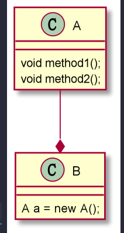	


---


#  设计原则核心思想

- 找出应用中可能需要变化之处，把它们独立出来，不要和那些不需要变化的代码混在一起。 
- 针对接口编程，而不是针对实现编程。 
- 为了交互对象之间的松耦合设计而努力


---


# UML图介绍

**基本介绍：**

- UML——Unified modeling language UML (统一建模语言)，是一种用于软件系统 分析和设计的语言工具，它用于帮助软 件开发人员进行思考和记录思路的结果。
-  UML本身是一套符号的规定，就像数学 符号和化学符号一样，这些符号用于描 述软件模型中的各个元素和他们之间的 关系，比如类、接口、实现、泛化、依 赖、组合、聚合等。


---


## UML类图

- 他是UML图的一种

- 用于<font color='red'>描述系统中的类(对象)本身的组成和类(对象)之间的各种静态关系</font>。 
- 类之间的关系：<font color='red'>依赖、泛化（继承）、实现、关联、聚合与组合</font>。

**依赖关系：**

- 只要是在类中用到了对方，那么他们之间就存在依赖关系。 所以他是一种很**宽泛**的概念。 

  

**泛化关系**：

- 其实就是继承关系，他是**依赖关系的一种特例**。

  

**实现关系：**

- 其实就是一个类实现了另一个类。 他也是**依赖关系的一种特例**。

  

**关联关系：**

- 实际上就是**类与类之间的联系**，**他是依赖关系的特例**。 


**聚合关系：**

- 表示的是整体和部分的关系，<font color='red'>整体与部分可以分开</font> 。 <font color='red'>是关联关系的特例</font>。
- 我中包含了你，但是就算没有你，我也可以运行。 contains关系 

- 举例：

  ```Java
  public class Computer {
  	private Mouse mouse; 
  	private Moniter monitor;
  	public void setMouse(Mouse mouse) {
  		this.mouse = mouse;
  	}
  	public void setMonitor(Moniter monitor) {
  		this.monitor = monitor;
  	}
  	
  }
  ```

  在`Computer`类中， `mouse`和`monitor`他们两个是可以分离的。 因为如果我们不通过`setMouse`和`setMonitor`方法对他们两个进行赋值时，

  他们两个其实是没用的，是一个空的变量。 

  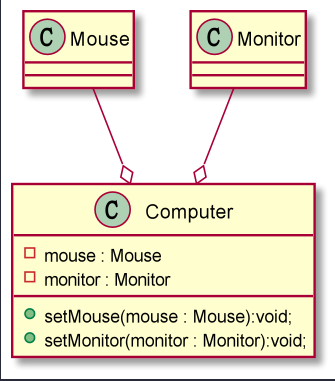	


**组合关系：**

- **也是整体与部分的关系，但是整体与部分不可以分开**。

- **举例：**

  ```java
  class Computer{
      private Mouse mouse; 
  	private Moniter monitor;
      //CPU和Computer就是组合关系。 当Computer创建对象时，cpu这个对象就一定会被创建好
  	private CPU cpu = new CPU();
  	public void setMouse(Mouse mouse) {
  		this.mouse = mouse;
  	}
  	public void setMonitor(Moniter monitor) {
  		this.monitor = monitor;
  	}
  
  }
  
  ```

  很显然，一台电脑如果想要运行，就不能没有CPU。 就算没有显示器和鼠标，电脑都能运行。 

  所以CPU就和Computer是组合关系。Computer包含CPU，但是不能分离CPU。 

  从上述代码层面来看：  `mouse`和`monitor`对象如果不调用`setMouse`和`setMonitor`方法就无法被赋值使用。 但是`cpu`这个对象，从`Computer`对象创建完成，他也会创建完成。 它是随着computer对象的出现而出现。  

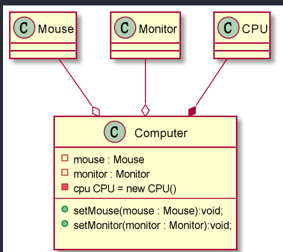					


- 组合关系不一定都是上述例子的那种形式。 只要是不可分离的都可以。

  - 比如说给上述代码修改，

  - ```java
    class Computer{
        private Mouse mouse; 
    	private Moniter monitor;
        public Computer{
            //把创建cpu的对象放到构造方法中。 仍然是聚合关系
            private CPU cpu = new CPU();
        }
    	public void setMouse(Mouse mouse) {
    		this.mouse = mouse;
    	}
    	public void setMonitor(Moniter monitor) {
    		this.monitor = monitor;
    	}
    }
    
    ```

    

---


## IDEA插件 PlantUML使用介绍

- 定义权限

  

  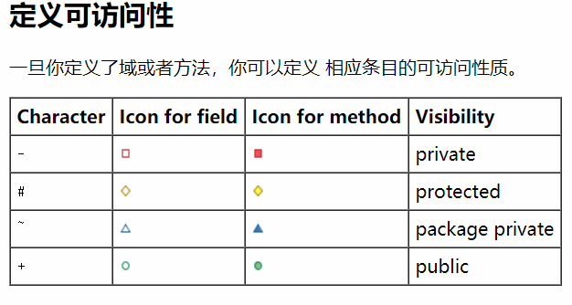	

- 类与类之间的关系：

  - 依赖关系:
    - `..>`
  - 泛化关系
    - `<|--` 来表示泛化关系
  - 实现关系
    - `<|..`
  - 关联关系
    - `-->`
  - 聚合关系
    - `--o`
  - 组合关系
    - `*--`

- 注释和模板

  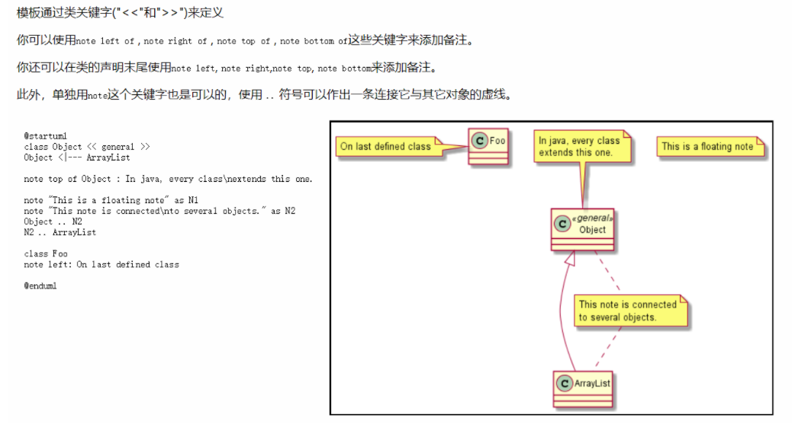


# 设计模式介绍

- 设计模式是程序员在<font color='red'>面对同类软件工程设计问题所总结出来的有用的经验， 模式不是代码，而是某类问题的通用解决方案</font>，设计模式（Design pattern） 代表了最佳的实践。这些解决方案是众多软件开发人员经过相当长的一段时 间的试验和错误总结出来的。
- 设计模式的本质提高 <font color='red'>软件的维护性，通用性和扩展性，并降低软件的复杂 度</font>。
- 设计模式并不局限于某种语言，java，php，c++ 都有设计模式.


**常见的设计模式类型：**

分为三种类型，共23种，并不绝对，可能还会有某种类型的变种。 

- 创建型模式： 
  - 单例模式、抽象工厂模式、原型模式、建造者模式、工厂模式。
- 结构型模式：
  - 适配器模式、桥接模式、装饰模式、组合模式、外观模式、享 元模式、代理模式。
- 行为型模式：
  - 模版方法模式、命令模式、访问者模式、迭代器模式、观察者 模式、中介者模式、备忘录模式、解释器模式（Interpreter模式）、状态模式、策略模式、职责链模式(责任链模式)。


## 单例模式

**基本介绍：**

- 所谓类的单例设计模式，就是采取一定的方法保证在整个的软件系统中，**对某个类只能存在一个对象实例，并且该类只提供一个取得其对象实例的方法(静态方法)**

**单例模式有八种方式：**

1. 饿汉式(静态常量) 
2. 饿汉式（静态代码块） 
3. 懒汉式(线程不安全) 
4. 懒汉式(线程安全，同步方法) 
5. 懒汉式(线程安全，同步代码块) 
6. <font color='red'> 双重检查 （推荐使用）</font>
7. <font color='red'>静态内部类（推荐使用） </font>
8. <font color='red'>枚举（推荐使用）</font>


### 饿汉式(静态常量) 

- **步骤如下：** 

  - 构造器私有化 (防止 new ) 
  - 类的内部创建对象 
  - 向外暴露一个静态的公共方法。getInstance

- **代码举例：**

  ```java
  class SingleTon1{
     
      //1. 私有化构造器
      public SingleTon1(){};
      
      //2. 创建一个私有静态常量对象
      private static final SingleTon1  singleTon1 =  new SingleTon1();
      
      //3. 提供一个公共的getInstance方法，获取对象
      public static  SingleTon1 getInstance(){
          return singleTon1;
      }
  }
  ```

- **优缺点分析：**

  **优点：**

  - 这种写法比较简单，就是在类装载的时候就完成实例化(静态常量在类加载期间就会初始化)。避免了线程同 步问题。

  **缺点：**

  - 在类装载的时候就完成实例化，没有达到Lazy Loading(懒加载)的效果。如果从始 至终从未使用过这个实例，则会造成内存的浪费。

  **结论：**

  - 这种单例模式可用，可能造成内存浪费


### 饿汉式（静态代码块）

**具体步骤：**

- 把对象的实例化放到了静态代码块中。


**代码演示：**	

```java
class SingleTon2 {
    
    //1. 私有化构造器
    public SingleTon2() {
    }
    
    //2. 创建一个私有静态常量
    private static final  SingleTon2 singleTon2;
    
    //3. 在静态代码块中给该对象创建出来
    static {
        singleTon2 = new SingleTon2();
    }
    
    //4. 提供一个公共的getInstance方法，获取对象
    public static SingleTon2 getInstance() {
        return singleTon2;
    }
}
```

**优缺点：**

- 与使用静态变量的优缺点一致。 因为他俩基本上是一样的。 


### 懒汉式（线程不安全）

**基本介绍：**

- 用到了我再去创建对象的实例。 实现了Lazy Loadin懒加载的效果.

**代码演示：**

```java
class SingleTon3{
    
    //1. 创建静态变量
    private static SingleTon3 instance;
    
    //2. 私有化构造器
    private SingleTon3(){}
    
    //3. 提供一个public方法，用于获取实例.
    public static SingleTon3 getInstance(){
        if (instance == null){
            instance = new SingleTon3();
        }
        return instance;
    }
    
}
```

**优缺点说明:**

- 起到了Lazy Loading的效果，但是只能在单线程下使用。
- 在多线程情况下，他是<font color='red'>线程不安全</font>的。 **所以不能在多线程情况下使用**


### 懒汉式(同步方法， 线程安全）

- 在上一个方法的基础上加入synchronized锁机制，来实现线程同步.


**代码演示：**

```java
class SingleTon{
    
    //1. 创建静态变量
    private static SingleTon instance;
    
    //2. 私有化构造器
    private SingleTon(){}
    
    //3. 提供一个public方法，用于获取实例.
    public static synchronized SingleTon getInstance(){
        if (instance == null){
            instance = new SingleTon();
        }
        return instance;
    }
    
}
```

**优缺点说明：**

- 解决了线程不安全问题
- 效率太低了，每个线程在想获得类的实例时候，执行getInstance()方法都要进行 同步。


### 懒汉式(同步代码块)

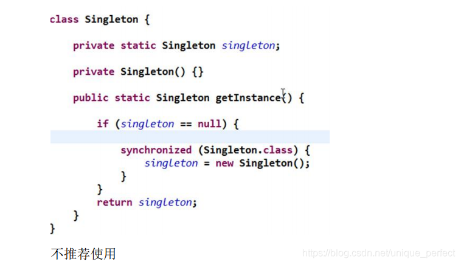


- **此方法并没有起到线程同步的作用**。虽然降低了锁的粒度，但是没有把最关键的if判断添加进去。
- 在实际开发中，不能使用这种方式。


### 双重判断

**基本介绍：**

- 使用`synchronized`和`volatile`关键字搭配使用，并且增加双重判断机制. 

**代码演示：**

```java

class SingleTon{
    
    //1. 创建静态变量
    private static volatile SingleTon instance;
    
    //2. 私有化构造器
    private SingleTon(){}
    
    //3. 提供一个public方法，用于获取实例.
    public static SingleTon getInstance(){
        if (instance == null){
            synchronized (SingleTon.class){
                if (instance == null ){
                    instance = new SingleTon();
                }
            }
        }
        return instance;
    }
    
}
```

**优缺点说明：**

-  Double-Check概念是多线程开发中常使用到的，如代码中所示，我们进行了两次if (singleton == null)检查，这样就可以保证线程安全了。
- 这样，**实例化代码也就是同步代码块中的方法只用执行一次**，后面再次访问时，判断外层if (singleton == null)， 直接return实例化对象，也避免的反复进行方法同步.
- 线程安全；延迟加载；效率较高
- 在实际开发中，推荐使用这种单例设计模式


### 静态内部类

**基本介绍：**

- 利用静态内部类的特性来实现单例模式


**代码演示：**

```java

class Singleton{
    //1. 私有化构造器
    private SingleTon(){}
    
    //2. 创建一个私有的静态内部类
    private static class SingletonInstance{
        private static final  Singleton instance = new Singleton();
    }
    
    //3. 设置一个public方法用于获取实例
    public static Singleton getInstance(){
        return SingletonInstance.instance;
    }
    
}
```

**优缺点说明：**

- **首先它实现了懒加载**。 因为在`Singleton`加载时，它的内部类`SingletonInstance`并不会被加载。 当我们调用`getInstance`方法时，才会加载此类。从而完成Singleton的实例化。
- 类的静态属性只会在第一次加载类的时候初始化，所以在这里，JVM帮助我们保证了线程的安全性，在类进行初始化时别的线程是无法进入的。`instance`的实例化过程是**线程安全的**。
- 避免了线程不安全，利用静态内部类特点实现延迟加载，效率高

**推荐使用.**


### 枚举

- 还可以通过枚举类的方式来实现单例模式

**代码演示：**

```java
enum Singleton{
    INSTANCE;
}
```

**优缺点说明：**

-  这借助JDK1.5中添加的枚举来实现单例模式。不仅能避免多线程同步问题，而 且还能防止反序列化重新创建新的对象。
- 可以防止通过反射来破坏单例
- 推荐使用,实现简单


